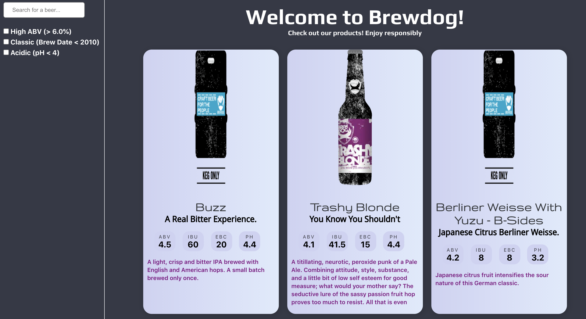

# Punk API

This project fetches data from an API created by Brewdog containing various pieces of information pertaining to some of their beers. It displays information about each individual beer in a card and users can search or filter by certain attributes to find more specifically what they are looking for.

## Technologies Used

- HTML
- CSS
- SCSS
- Vanilla JS
- React
- JSON
